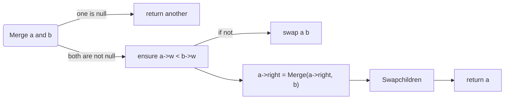

<center><font  size=8>Texture Packing</font></center>
<center><font  size=4>Authors:\hidden\</font></center>

<center><font  size=5>Date :2022-5-16</font></center>

<div style="page-break-after:always;"></div>


# 1. Introduction

Texture Packing is to pack multiple rectangle shaped textures into one large texture. The resulting texture must have a given width and a minimum height.This project requires you to design an approximation algorithm that runs in polynomial time. You must generate test cases of different sizes (from 10 to 10,000) with different distributions of widths and heights. A thorough analysis on all the factors that might affect the approximation ratio of your proposed algorithm is expected.


### Input Specification:

 For each case, the first line gives an integer *N* (2≤*N*≤63), then followed by a line that contains all the *N* distinct characters and their frequencies in the following format:

```
c[1] f[1] c[2] f[2] ... c[N] f[N]
```

where `c[i]` is a character chosen from {'0' - '9', 'a' - 'z', 'A' - 'Z', '_'}, and `f[i]` is the frequency of `c[i]` and is an integer no more than 1000. The next line gives a positive integer *M* (≤1000), then followed by *M* student submissions. Each student submission consists of *N* lines, each in the format:

```
c[i] code[i]
```

where `c[i]` is the `i`-th character and `code[i]` is an non-empty string of no more than 63 '0's and '1's.

### Output Specification:

For each test case, print in each line either "Yes" if the student's submission is correct, or "No" if not.


# 2 Algorithm Specification

Our algorithm use the following data structure:

```c++
typedef struct skewheap skew;
struct skewheap
{
    int w;
    skew *left, *right;
    skewheap(int a) : w(a), left(nullptr), right(nullptr) {}
};
```

Our algorithm for solving the problem can be roughly divided into 4 steps:

1.**Insert**: Insert an element into the heap.

2.**Delete_min**: Delete the root and merge the leftchild and rightchild.

3.**Merge**: Merge the two heaps and following the rule for skew heap.

4.**Huffman**: Adjust the structure of the tree to meet the rules of Huffman trees.

5.**Judge** :Determines whether the given code is Huffman code

***

### Merge

```pseudocode
Function Merge(skew *&a, skew *&b)//Merge heap a and b
    If one of them is empty,return another
    if (a->w > b->w)//Make sure the heap with the smaller root value comes first
        return Merge(b, a);
    a->right := Merge(a->right, b);
    SwapChildren(a)
    return a;
end Merge
```

Always swap the left and right children except that the largest of all the nodes on the right paths does not have it children swappend.



***

### Insert

```pseudocode
procedure Insert(skew *&h,Element a )
	skew *&t := new skewheap(a)
	h := Merge(h,t)
end Insert
```

**Think of an insertion as a merge.** One of the heaps contains only one element.

***

### Delete_min

```pseudocode
procedure Delete_min(skew *&h)
	 h := Merge(h->left,h->right);
end Delete_min
```

**Think of an deletion as a merge.**  heap a and b are heap h 's leftchild and right child.

***

### Huffman

```pseudocode
procedure Huffman(skew *&h)
    a := h->w;
    Delete_min(h); // delete root
    b := h->w;
    Delete_min(h);    // delete root
    Insert(h, a + b); // insert a new node into the tree
    wpl += a + b;
end Huffman
```

Remove the two smallest values in the heap and reinsert the sum into the heap.

Calculate the weighted path length of huffman tree(WPL)

***

### Judge

```pseudocode
procedure judge()
    for i := 0 to n: 
    	this_wpl+=code[i].length * weight[i]
    if(this_wpl != correct_wpl)
    	flag := false
    else
    	for i := 0 to n: 
    		for k := 0 to n: 
    			code[i] is the prefix of code[k]
    			flag := false	
end judge
```

Methods to determine if it's Huffman coding:

-  Huffman encoding is performed on the given characters to obtain the weighted path length (WPL) of the Haverman tree, which is compared with each input Huffman encoding (the input WPL can be obtained by calculating the total character length).
- For codes that meet condition 1, judge whether any character code is not the prefix of other character codes (sort codes from short to long and then compare them one by one)


### optimize: Dictionary tree algorithm

```pseudocode
procedure Dictionary_tree()
	skewheap *root = new skew(-1);
    for i := 0 to n:
       skewheap *temp = root;
       bool new_node = true;
       for k := 0 to code[i].length():
           if (!new_node && temp->left == nullptr && temp->right == nullptr)
                flag = false;
                break;
            if (code[i][k] == '0')
                if (temp -> left == nullptr) :         
                    skewheap *t = new skew(0);
                    temp -> left = t;
                    new_node = true;       
                else
                    new_node = false;
                temp = temp -> left;
            else
                 Do the similar thing for branches of 1
        if (!new_node)
             flag = false;
             break;
 end Dictionary_tree          
```

We use codes to build dictionary trees. We build the dictionary tree while iterating through the code. When there are two codes on the same path, one is the prefix of the other.

Here is a dictionary tree containing hell,hi,new, and nop.This is used to explain the establishment of a dictionary tree


***


# 3. Testing Results

#### Testing for code correctness

|       The same frequency situation+lowercase character       |          the code is not corresponding to frequency          |
| :----------------------------------------------------------: | :----------------------------------------------------------: |
|  |  |
|   Non-Huffman coding but the same length as Huffman coding   |                       Proffix conflict                       |
|  |  |

|                       The given sample                       |
| :----------------------------------------------------------: |
|  |
|       PTA Data Structures and Algorithms (English) 7-9       |
|  |

***

### Testing for time

**This section tests the running time of only one set of inputs, because it is easy to figure out the relationship of time to N.**

**This program can run multiple groups of input**

ps:The runtime does not include the time to read the input

##### When the run result is yes,and K=1000

- N=7

  

- N=14


- N=26


- N=40


- N=52


- N=63


##### When the run result is NO,and K=1000

- N=7


- N=14


- N=40


##### Dictionarytree yestime

- N=7


- N=14


- N=26


- N=40


- N=52


- N=63


| N                     | 7    | 14   | 26   | 40   | 52   | 63   |
| --------------------- | ---- | ---- | ---- | ---- | ---- | ---- |
| YES/ms                | 23   | 52   | 133  | 281  | 515  | 731  |
| NO/ms                 | 20   | 42   | 82   | 124  | 176  | 206  |
| Dictionarytree_YES/ms | 37   | 79   | 148  | 234  | 312  | 366  |

Time grows as N increases:


When the result is No, the judgment will be terminated in advance because the conditions are not met, resulting in a lower value than when the result is Yes.

We use dictionary trees to simplify the judgment method.

When N is small, the constant time of the tree greatly affects the total time. 

But as N increases, the total running time is smaller than before optimization.


# 4 Analysis and Comments

#### Analysis

#### Time complexity

**For simplicity, we will substitute amortized time for time complexity** .

For skew heap, any M consecutive operations take at most  $O(MlogN)$ time.

**For Merge:** The amortized time is $O(logN)$ . 

**For insert:** The amortized time is $O(1)$ .

**For delete_min:** The amortized time is $O(logN)$ .

For **Huffman()**: It simply call **Insert()** and **Delete_min()** function .So its time complexity is $O(logN)$ too.

For **main()** ,the time consumed  is  as follows:

- Read in each node and weight, and construct Huffman tree. The time complexity is $O(NlogN)$ 
- In every judgment:
  - Calculate this_wpl and compare it with correct wpl. The time complexity is $O(N)$ 
  -  Check if there is a prefix conflict: For N characters, we use 2 **for loop** to check if there ' s a conflict. The time complexity is $O(N^2)$ . But because in general the length of characters is incremented instead of being represented by nearly n bits, a more accurate time is less than  $N(N-1)/2$ . 
  -  **Use dictionary tree to optimize prefix judgment**: We use codes to build dictionary trees. The time complexity is related to the height of the tree for each retrieval. There are N codes. The time complexity is $O(NlogN)$
- There 's M judgment in total.

**So, the whole project 's time complexity is $O(MN^2)$** 

**If we use dictionary tree to optimize prefix judgment, the whole project 's time complexity is $O(MNlogN)$** 

***


#### Space complexity

We use arrays to store characters and their weights and each group of code, and use these values to construct Huffman trees.The space complexity is $O(N)$. 

(**Use dictionary tree to optimize prefix judgment**: We need N space to build an extra dictionary tree)

**So, the whole project 's space complexity is $O(N)$** 

***

#### Comments

It can be seen from the test results that the increase of N number and the difference of character encoding length also significantly affect the time

In practice, the cost of reading data is not small, and the large amount of data also means that it takes longer to read the input, which also affects the running time of the whole algorithm.

# Appendix 

Huffmancode.c

```c++
#include <iostream>
#include <string>
using namespace std;

typedef struct skewheap skew;
struct skewheap
{
    int w;
    skew *left, *right;
    skewheap(int a) : w(a), left(nullptr), right(nullptr) {}
};
int n, wpl(0); // n is the number of the total distinct characters and the wpl is the corrected wpl

void Insert(skew *&h, int a);//Think of an insert as a merge. One of the heaps contains only one element
skew *Merge(skew *&a, skew *&b);//Merge heap a and b
void Delete_min(skew *&h);//Delete the root and merge the leftchild and rightchild.
void Huffman(skew *&h);// Adjust the structure of the tree to meet the rules of Huffman trees.

int main()
{
    char ch[100];
    int w[100], m;
    cin >> n;
    for (int i = 0; i < n; i++)
        cin >> ch[i] >> w[i];
    skew *h = nullptr;
    for (int i = 0; i < n; i++)
        Insert(h, w[i]); // insert into a skew tree
    for (int i = 1; i < n; i++)
        Huffman(h); // adjust the structure of the tree
    cin >> m;
    while (m)
    {
        string s[100];
        char c;
        bool flag = true; // judge whether the input is correct
        int sub_wpl = 0;
        for (int i = 0; i < n; i++)
        {
            cin >> c >> s[i];
            sub_wpl += s[i].length() * w[i]; // calculate the wpl of the input data
        }
        if (sub_wpl != wpl)
            flag = false;
        else
        {
            for (int i = 0; i < n; i++)
            {
                int l = s[i].length();
                for (int k = 0; k < n; k++)
                {
                    if (i == k || l > s[k].length()) // skip itself and strings of less than l length
                        continue;
                    if (s[i] == s[k].substr(0, l)) // s[i] is the prefix of s[k]
                    {
                        flag = false;
                        break;
                    }
                }
                if (flag == false)
                        break;
            }
        }
        if (flag)
            cout << "Yes" << endl;
        else
            cout << "No" << endl;
        m--;
    }
   // system("pause");
}

void Insert(skew *&h, int a)//Think of an insert as a merge. One of the heaps contains only one element
{
    skew *t = new skewheap(a);
    h = Merge(h, t);
}

skew *Merge(skew *&a, skew *&b)//Merge heap a and b
{
    if (!a)//If one of them is empty,return another
        return b;
    if (!b)
        return a;
    if (a->w > b->w)//Make sure the heap with the smaller root value comes first
        return Merge(b, a);
    a->right = Merge(a->right, b);
    skew *temp = a->left; // swap a -> left and a -> right
    a->left = a->right;
    a->right = temp;
    return a;
}

void Delete_min(skew *&h)//Delete the root and merge the leftchild and rightchild.
{
    if (!h)
        return;
    skew *a, *b;
    a = h->left;
    b = h->right;
    h = Merge(a, b);
}

void Huffman(skew *&h)//Adjust the structure of the tree to meet the rules of Huffman trees.
{
    int a, b;
    a = h->w;
    Delete_min(h); // delete root
    b = h->w;
    Delete_min(h);    // delete root
    Insert(h, a + b); // insert a new node into the tree
    wpl += a + b;
}
```

TestTime.c

```c++
#include <iostream>
#include <string>
#include<ctime>
using namespace std;

typedef struct skewheap skew;
struct skewheap
{
    int w;
    skew *left, *right;
    skewheap(int a) : w(a), left(nullptr), right(nullptr) {}
};

int n, wpl(0); // n is the number of the total distinct characters and the wpl is the corrected wpl
void Insert(skew *&h, int a);//Think of an insert as a merge. One of the heaps contains only one element
skew *Merge(skew *&a, skew *&b);//Merge heap a and b
void Delete_min(skew *&h);//Delete the root and merge the leftchild and rightchild.
void Huffman(skew *&h);// Adjust the structure of the tree to meet the rules of Huffman trees.

int main()
{
    int K, t, j, w[100], m;
    char ch[100];
    string c;
    clock_t start, finish;
    cout << "Please enter the repeat times(The recommended value is larger than 1000):" << endl;
    cin >> K;
    cin >> n;
    for (int i = 0; i < n; i++)
        cin >> ch[i] >> w[i];
    cin >> m;
    string s[m][100];
    for (int i = 0; i < m; i++)
    {
        for (j = 0; j < n;j++)
            cin >>c>> s[i][j];
    }
    start = clock();
    for (t = 0; t < K; t++ ){
        skew *h = nullptr;
        wpl = 0;
        for (int i = 0; i < n; i++)
            Insert(h, w[i]); // insert into a skew tree
        for (int i = 1; i < n; i++)
            Huffman(h); // adjust the structure of the tree
        for (j = 0; j < m; j++ )
        {
            bool flag = true; // judge whether the input is correct
            int sub_wpl = 0;
            for (int i = 0; i < n; i++)
            {
                sub_wpl += s[j][i].length() * w[i]; // calculate the wpl of the input data
            }
            if (sub_wpl != wpl)
                flag = false;
            else
            {
                for (int i = 0; i < n; i++)
                {
                    int l = s[j][i].length();
                    for (int k = 0; k < n; k++)
                    {
                        if (i == k || l > s[j][k].length()) // skip itself and strings of less than l length
                            continue;
                        if (s[j][i] == s[j][k].substr(0, l)) // s[i] is the prefix of s[k]
                        {
                            flag = false;
                            break;
                        }
                    }
                    if (flag == false)
                            break;
                }
            }
            if(t==0){
                if (flag)
                    cout << "Yes" << endl;
                else
                    cout << "No" << endl;
            }
            
        }
    }
    finish = clock();    
    cout <<"For "<<K<<" round ,the time cost is:" << double(finish-start)*1000 / CLOCKS_PER_SEC<<" ms"<<endl;
    system("pause");
}

void Insert(skew *&h, int a)//Think of an insert as a merge. One of the heaps contains only one element
{
    skew *t = new skewheap(a);
    h = Merge(h, t);
}

skew *Merge(skew *&a, skew *&b)//Merge heap a and b
{
    if (!a)//If one of them is empty,return another
        return b;
    if (!b)
        return a;
    if (a->w > b->w)//Make sure the heap with the smaller root value comes first
        return Merge(b, a);
    a->right = Merge(a->right, b);
    skew *temp = a->left; // swap a -> left and a -> right
    a->left = a->right;
    a->right = temp;
    return a;
}

void Delete_min(skew *&h)//Delete the root and merge the leftchild and rightchild.
{
    if (!h)
        return;
    skew *a, *b;
    a = h->left;
    b = h->right;
    h = Merge(a, b);
}

void Huffman(skew *&h)//Adjust the structure of the tree to meet the rules of Huffman trees.
{
    int a, b;
    a = h->w;
    Delete_min(h); // delete root
    b = h->w;
    Delete_min(h);    // delete root
    Insert(h, a + b); // insert a new node into the tree
    wpl += a + b;
}
```

TestTime2.c

```c++
#include <iostream>
#include <string>
#include<ctime>
using namespace std;

typedef struct skewheap skew;
struct skewheap
{
    int w;
    skew *left, *right;
    skewheap(int a) : w(a), left(nullptr), right(nullptr) {}
};

int n, wpl(0); // n is the number of the total distinct characters and the wpl is the corrected wpl
void Insert(skew *&h, int a);//Think of an insert as a merge. One of the heaps contains only one element
skew *Merge(skew *&a, skew *&b);//Merge heap a and b
void Delete_min(skew *&h);//Delete the root and merge the leftchild and rightchild.
void Huffman(skew *&h);// Adjust the structure of the tree to meet the rules of Huffman trees.

int main()
{
    int K, t, j, w[100], m;
    char ch[100];
    bool flag;
    string c;
    clock_t start, finish;
    cout << "Please enter the repeat times(The recommended value is larger than 1000):" << endl;
    cin >> K;
    cin >> n;
    for (int i = 0; i < n; i++)
        cin >> ch[i] >> w[i];
    cin >> m;
    string s[m][100];
    for (int i = 0; i < m; i++)
    {
        for (j = 0; j < n;j++)
            cin >>c>> s[i][j];
    }
    start = clock();
    for (t = 0; t < K; t++ ){
        skew *h = nullptr;
        wpl = 0;
        for (int i = 0; i < n; i++)
            Insert(h, w[i]); // insert into a skew tree
        for (int i = 1; i < n; i++)
            Huffman(h); // adjust the structure of the tree
        for (j = 0; j < m; j++ )
        {
            flag = true; // judge whether the input is correct
            int sub_wpl = 0;
            for (int i = 0; i < n; i++)
            {
                sub_wpl += s[j][i].length() * w[i]; // calculate the wpl of the input data
            }
            if (sub_wpl != wpl)
                flag = false;
            else
            {
                skewheap *root = new skew(-1);//build a dictionary tree, just borrowing the data structure from the skew heap
                for (int i = 0; i < n; i++)
                {
                    skewheap *temp = root;
                    int l = s[j][i].length();
                    bool new_node = true;//whether current node is newly created
                    for (int k = 0; k < l; k++)
                    {
                        if (s[j][i][k] == '0')
                        {
                            if (temp -> left == nullptr)//create '0' node
                            {
                                skewheap *t = new skew(0);
                                temp -> left = t;
                                new_node = true;
                            }
                            else
                                new_node = false;
                            temp = temp -> left;
                        }
                        else
                        {
                            if (temp -> right == nullptr)//create '1' node
                            {
                                skewheap *t = new skew(1);
                                temp -> right = t;
                                new_node = true;
                            }
                            else
                                new_node = false;
                            temp = temp -> right;
                        }
                        if (!new_node && temp->left == nullptr && temp->right == nullptr)//judge whethe it is a leaf code
                        {
                            flag = false;
                            break;
                        }
                    }
                    if (!new_node)
                    {
                        flag = false;
                        break;
                    }
                }
            }  
        }
    }
    finish = clock();  
    if (flag)
        cout << "Yes" << endl;
    else
        cout << "No" << endl;  
    cout <<"For "<<K<<" round ,the time cost is:" << double(finish-start)*1000 / CLOCKS_PER_SEC<<" ms"<<endl;
    system("pause");
}

void Insert(skew *&h, int a)//Think of an insert as a merge. One of the heaps contains only one element
{
    skew *t = new skewheap(a);
    h = Merge(h, t);
}

skew *Merge(skew *&a, skew *&b)//Merge heap a and b
{
    if (!a)//If one of them is empty,return another
        return b;
    if (!b)
        return a;
    if (a->w > b->w)//Make sure the heap with the smaller root value comes first
        return Merge(b, a);
    a->right = Merge(a->right, b);
    skew *temp = a->left; // swap a -> left and a -> right
    a->left = a->right;
    a->right = temp;
    return a;
}

void Delete_min(skew *&h)//Delete the root and merge the leftchild and rightchild.
{
    if (!h)
        return;
    skew *a, *b;
    a = h->left;
    b = h->right;
    h = Merge(a, b);
}

void Huffman(skew *&h)//Adjust the structure of the tree to meet the rules of Huffman trees.
{
    int a, b;
    a = h->w;
    Delete_min(h); // delete root
    b = h->w;
    Delete_min(h);    // delete root
    Insert(h, a + b); // insert a new node into the tree
    wpl += a + b;
}
```


# Declaration

***We hereby declare that all the work done in this project titled "Huffman code" is of our independent effort.*** 

