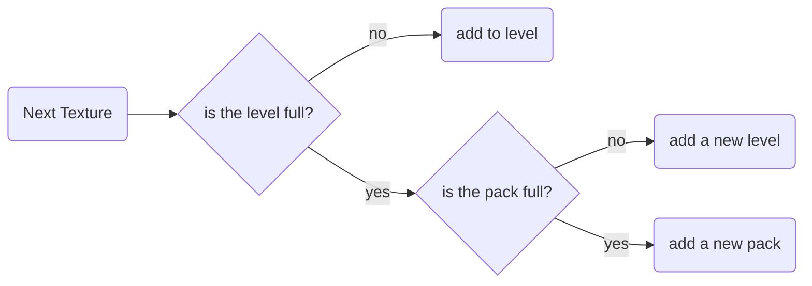

<center><font  size=8>Texture Packing</font></center>
<center><font  size=4>Authors:Team 15</font></center>

<center><font  size=5>Date :2022-5-16</font></center>

<div style="page-break-after:always;"></div>

# Updates On Final (5.22)

1. completed the Analysis on the upperbound. The proof in the original file was not completed.
2. Put additional information on the differences between the concept of texture and bin
3. specified the approximation-ratio.
4. updated the output format and output specification. Now it will simply output the maximum height.


# 1. Introduction

In computer graphics, there is a notion called texture atlas (also called a spritesheet or an image sprite in 2d game development) ,which is an image containing multiple smaller images, usually packed together to reduce overall dimensions. An atlas can consist of uniformly-sized images or images of varying dimensions. A sub-image is drawn using custom texture coordinates to pick it out of the atlas.

To realize the notion of texture atlas, a method called texture packing is needed. Texture Packing is to pack multiple rectangle shaped textures into one large texture. 

This project is to design an approximation algorithm that runs in polynomial time.


Noun Definition:

**Texture**: an image containing multiple smaller images, usually packed together to reduce overall dimensions. An atlas can consist of uniformly-sized images or images of varying dimensions. A sub-image is drawn using custom texture coordinates to pick it out of the atlas. This is an **Applicational Concept**. The other essential aspect is that texture is a **2-dimensional-level object**.

**bin&package**: this is the original **Mathematical Concept**, the puzzle of texture packing is based on the bin-packing problem. Bin is a 1-dimensional object.


### Input Specification:

Input format (all inputs support integers only)

1. input the number of iterations K (preferably around 1000), for the loop time
2. Input the size of package, width first, then height eg: 30 50
3. enter the number of texture N
4. enter the size of the N Texture first width and then height eg: 3 5 (the width and height of the texture must be less than or equal to the width and height of the package)--In test, we use randomly generated inputs.


### Output Specification:

the output gives out the information in packages in a format like this

```
[level 0]
texture 1: (3,5)
***
texture n: (n1,n2)
***

[level 0]
texture 1: (3,5)
***
texture n: (n1,n2)
***

For *** round ,the time cost is:** ms
```


----


# 2. Algorithm Specification

**Note**: below shows the algorithm with package-filling. The final step we take only measures the level. That is to say, the problem that we solve can be simply simplified to one package that is infinitely large.


Our algorithm use the main idea of the next-fit algorithm (just like the one adpoted in bin-packing problem). 

For bin packing, next-fit is an online algorithm. Ideally, we would like to use as few bins as possible, but minimizing the number of bins is an NP-hard problem. The next-fit algorithm uses the following heuristic:

1. It keeps a current bin, which is initially empty.

2. When an item arrives, it checks whether the item fits into the current bin. 

   If it fits, it is placed inside it. 

   Otherwise, the current bin is closed, a new bin is opened and the coming item is placed inside this new bin.

Next-Fit is a bounded space algorithm - it requires only one partially-filled bin to be open at any time. 


Likewise, for texture packing, the next-fit algorithm uses the same idea with a slight difference.

1. It keeps a current pack, which is initially empty.
2. It keeps the current level, which is initially empty.
3. When an texture arrives, it checks whether the item fits into the current level. 
   1. If it fits, it is placed inside it. 
   2. Otherwise, the current level is closed, a new level is opened and the coming item is placed inside this new level.
   3. Or otherwise - if the new level doesn't fit in the pack, the current pack is closed, a new pack is opened and the coming item is placed inside this new pack.

the N-F algorithm for texture packing is a dimensional-expansion of the N-F algorithm for bin-packing.


we define the above-mentioned texture, level and pack as follows. each is a rectanglur object that is defined with height and width. Notably, the pack is a sequence with all the previous packs stored.

```c++
struct t{
    int width, height;
};
typedef t texture;
struct l{
    int height;
    int now_width;
};
typedef l* level;
struct p{
    vector<level> pack_level;
    int now_height;
    int level_num;
};
typedef p* pack;
```


The algorithm could be viewed as the graph below



the pseudo-code implementation of the above is presented below

```pseudocode
iterate K times ://K iteration
        sortbyheight(T); // bubble sort in descending order of height
        //next-fit
        iterate i = 0 to n:
            if (i == 0):
                p1 =  initialize();//initialize a package
                //package T[0]
            else:
            
            
                if(p1 has fittable level):
     //In this level,if pack T[i],the width will not exceed the given width after packing
                    pack T[i];
                    
                else:
     //In this level,if after packing T[i],the width exceeds the given width after packing
     
                    if(p1 exceeds level but in package):
     //We create a new layer for pack T[i](If after creating the new layer,the height will not exceed the given height)
                        create new level;
                        pack T[i];
                    else:
     //If it will not be packed in this package
                        create new pakage;
                        pack T[i];  
                        

print result;
```

a nice way to view the status in one package is illustrated by the graph below.			 	


***


# 3. Testing Results

we assme that the test iteration K = 1000

we use a random.c generating the random input

```c
#include<stdio.h>
#include<stdlib.h>
#include<time.h>
#include<string.h>
int main(int argc, char* argv[]){
    int w,h;
    srand((unsigned int)time(0));
    for (int i = 0; i < atoi(argv[1]);i++){
        h = rand() % 50 + 1;
        w = rand() % 30 + 1;
        printf("%d %d\n", w, h);
    }
    
    //system("pause");
}

```

to run the test example, I specifically wrote another shell script to run.

```shell
#!/bin/bash

rm input
rm main

gcc -o input random.c
g++ -o main pro6.cpp

K=1000
wid=30
hei=50
num=30

rm time_used

while(($num<=300))
do
    echo $K $wid $hei $num >temp
    ./input $num >> temp
    ./main < temp > result

    grep "number of packages:" result >> time_used
    grep "round ,the time" result >> time_used
    echo " " >> time_used
    let "num+=10"
done

echo output success
```

the result turns out like this

| Random_Input_Texture | Result | All_Time   |
| -------------------- | ------ | ---------- |
| 30                   | 13     | 10.601 ms  |
| 40                   | 18     | 16.425 ms  |
| 50                   | 22     | 19.055 ms  |
| 60                   | 25     | 23.571 ms  |
| 70                   | 32     | 28.504 ms  |
| 80                   | 35     | 31.883 ms  |
| 90                   | 40     | 39.211 ms  |
| 100                  | 44     | 41.965 ms  |
| 110                  | 49     | 47.606 ms  |
| 120                  | 51     | 52.219 ms  |
| 130                  | 55     | 59.954 ms  |
| 140                  | 60     | 65.37 ms   |
| 150                  | 66     | 71.739 ms  |
| 160                  | 72     | 79.599 ms  |
| 170                  | 77     | 86.382 ms  |
| 180                  | 87     | 92.061 ms  |
| 190                  | 92     | 98.882 ms  |
| 200                  | 98     | 108.098 ms |
| 210                  | 101    | 115.673 ms |
| 220                  | 103    | 121.155 ms |
| 230                  | 106    | 127.517 ms |
| 240                  | 108    | 133.804 ms |
| 250                  | 111    | 144.573 ms |
| 260                  | 114    | 152.682 ms |
| 270                  | 117    | 161.04 ms  |
| 280                  | 122    | 170.838 ms |
| 290                  | 126    | 181.938 ms |
| 300                  | 121    | 183.449 ms |


below is the package - N graph

in the graph below, the package can be understood as a measure of level.

### 

and below is the time - N graph


we can generally assume that our algorithm follows in polynomial time.


# 4. Analysis

#### Analysis

##### Upperbound

Suppose that we denote by NF(L) the number of bins used by NextFit, and by OPT(L) the optimal number of bins possible for the list L. By what we have learned in class, we have already derived that exists for Binpacking problem. A proof for that is given below (references the textbook and wikipidia).

For each list L,
$$
NF(L) \le 2 OPT(L) -1
$$
The intuition to the proof s the following. The number of bins used by this algorithm is no more than twice the optimal number of bins. In other words, it is impossible for 2 bins to be at most half full because such a possibility implies that at some point, exactly one bin was at most half full and a new one was opened to accommodate an item of size at most **B/2** . But since the first one has at least a space of **B/2**, the algorithm will not open a new bin for any item whose size is at most **B/2** . Only after the bin fills with more than **B/2** or if an item with a size larger than **B/2** arrives, the algorithm may open a new bin. Thus if we have bins, at least bins are more than half full. Therefore, 
$$
\Sigma_{i\in I } s(i) \ge \frac{K-1}{2}B
$$
Because 
$$
\frac{\Sigma_{i\in I } s(i)} {B}
$$
is a lower bound of the optimum value OPT, we get that 
$$
K - 1 \lt 2 OPT
$$
and therefore
$$
K \leq 2OPT
$$
now, for the texture-packing problem, we can easily see that the same proof stands with the same insight, because each package has a restricted width and therefore the whole proving process is exactly the same with the bin-packing NF-algorithm proof.

Hence we can derive that
$$
NF(L) \le 2·OPT(L) - 1
$$


##### Lowerbound

For each case, there exists a list L

 such that
$$
OPT(L) = N
$$
Hence the equation could be achieved in certain circumstances.
$$
NF(L) \ge OPT(L)
$$
in conclusion
$$
OPT(L) \le NF(L) \le 2·OPT(L) - 1
$$
our NF-algorithm is a **2-approximation algorithm.**

##### Time Comlexity

it is known that the optimal solution of bin-packing problem, i.e.,  minimizing the number of bins is an NP-hard problem. As is true with the case in texture-packing, **the optimal solution is NP-Hard** and can not be solved in polynomial time. However, our **NF-algorithm is a polynomial algorithm**.

1. the SortByHeight is a classical sorting method and could theoretically be implemented in 
   $$
   O(NlogN)
   $$
   although in practice and for coding-convenience, we used bubble sort to implement and get N-square time complexity, but the analysis stands at its correct states.

2. the inserting process is by applying the same rule for all the textures sequentially and do not involve interconnection with one object and all the other. The only variable to be recorded is simply the current level and the current height, therefore, the time complexity is
   $$
   O(N)
   $$

##### Space Complexity

As we could determine from the algorithm, we have only utilised the pack struct that may be enlarged as N goes higher. Since there is at most NF(N) packages, we determine that the space complexity is
$$
O(NF(N))
$$


# Appendix 

```c++
#include <iostream>
#include <vector>
#include <ctime>

int fix_width;   // width of package

int N;//number of texture

using namespace std;

struct t{
    int width, height;
};
typedef t texture;

struct l{
    int height;
    int now_width;
};
typedef l* level;
struct p{
    vector<level> pack_level;
    int now_height;
    int level_num;
};
typedef p* pack;

void sortbyheight(texture T[]){// bubble sort in descending order of height
    texture temp;
    for (int i = 0; i < N - 1; i++)
    {
        for (int j = 0; j < N - 1 - i; j++)
        {
            if(T[j].height<T[j+1].height){
                temp = T[j];
                T[j] = T[j + 1];
                T[j + 1] = temp;
            }
        }
    }
}

pack initialize(){//initialize the package
    pack p1 = new struct p;
    p1->level_num = 0;
    p1->now_height = 0;
    level l1 = new struct l;
    l1->height = 0;
    l1->now_width = 0;
    p1->pack_level.push_back(l1);

    return p1;
}

int main()
{
    clock_t start, finish;
    int K;
    cout << "Please enter the repeat times(The recommended value is around 1000):" << endl;
    cin >> K;
    cout << "Please enter the width of the package(eg:30):" << endl;
    cin >> fix_width;
    cout << "Please enter the number of texture(>0)(The recommended value is larger than 10)" << endl;
    cin >> N;
    texture T[N];
    // The default box is directional, it will not rotate the box because it is bigger than the height
    cout << "Please enter texture 's width(0<w<=package_width) and height respectively(eg:3 5)" << endl;
    for (int i = 0; i < N; i++){
        cin >> T[i].width >> T[i].height; //Enter the parameters of texture
    }
    start = clock(); 
	pack p1;
	cout << "[level 0]" << endl;
    for (int t = 0; t < K; t++){//K iteration
        sortbyheight(T); // bubble sort in descending order of height
        int h,w;
        for (int i = 0; i < N; i++ ){
            if (i == 0)
            {
                p1 =  initialize();//initialize a package
                //package T[0]
                p1->now_height = T[0].height;
                p1->pack_level[p1->level_num]->height = T[0].height;
                p1->pack_level[p1->level_num]->now_width += T[0].width;
                if(t==0)cout <<"texture "<<i+1<< ": (" << T[0].width << "," << T[0].height << ")" << endl; //Print the coordinates in the upper right corner of the texture
            }
            else{
                if(p1->pack_level[p1->level_num]->now_width + T[i].width <=fix_width){//In this level,if pack T[i],the width will not exceed the given width after packing
                    p1->pack_level[p1->level_num]->now_width += T[i].width;//pack T[i]
                }
                else{//In this level,if after packing T[i],the width exceeds the given width after packing
                  //We create a new layer for pack T[i](If after creating the new layer,the height will not exceed the given height)
                         if(t == 0)cout << "[level " << p1->level_num + 1 << "]" << endl;
						p1->level_num++;
                        level l1 = new struct l;
                        l1->height = l1->now_width = 0;
                        p1->pack_level.push_back(l1);//create a new layer 
                        p1->now_height+= T[i].height;//pack T[i]
                        p1->pack_level[p1->level_num]->height = T[i].height;
                        p1->pack_level[p1->level_num]->now_width += T[i].width;
                }
                h = p1->now_height - p1->pack_level[p1->level_num]->height;
                w = p1->pack_level[p1->level_num]->now_width;
                if(t==0) cout << "texture " << i + 1 << ": (" << w << "," << h + T[i].height << ")" << endl;//Print the coordinates in the upper right corner of the texture
            }
        }
    }
    finish = clock();
    cout << "min_height of packages: " << p1->now_height << endl;
    cout <<"For "<<K<<" round ,the time cost is:" << double(finish-start)*1000 / CLOCKS_PER_SEC<<" ms"<<endl;
    //system("pause");
}


```


# Declaration

***We hereby declare that all the work done in this project titled "Texture Packing" is of our independent effort.*** 

